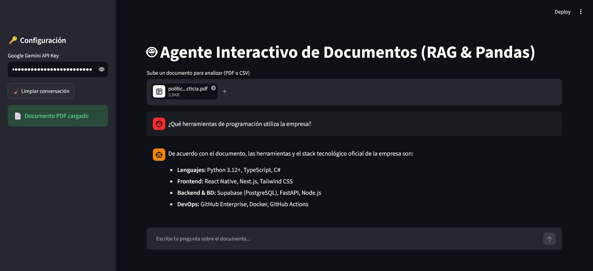

# 🤖 Multi-Document AI Agent (RAG & Pandas Analysis)

Un agente interactivo de Inteligencia Artificial desarrollado con **Streamlit**, **LangChain** y **Google Gemini 3.5 Flash**, capaz de analizar e interactuar contextualmente con documentos PDF complejos y conjuntos de datos estructurados en formato CSV.



> 🔗 **App en vivo:** https://tu-proyecto.streamlit.app *(Reemplazar con tu enlace real de Streamlit Cloud)*

---

# 📐 Arquitectura del Sistema

El agente adapta dinámicamente su flujo de trabajo según el formato del archivo cargado:

```text
 ┌────────────────┐     ┌───────────┐     ┌──────────────────────────────────────┐
 │ Archivo Subido ├────►│  Formato  ├────►│ PDF: Extraction -> Splitting -> FAISS│
 └────────────────┘     └─────┬─────┘     └──────────────────┬───────────────────┘
                              │                              │
                              │                    ┌─────────▼────────┐
                              │                    │ RAG + History    │
                              │                    └─────────┬────────┘
                              │                              │
                              └───────────► CSV: Pandas Agent│
                                                  │          │
                                                  ▼          ▼
                                            ┌─────────────────┐
                                            │ Gemini 3.5 API  │
                                            └─────────────────┘
```

## 🔹 Componentes Clave

### 📄 Procesamiento de PDF (RAG + FAISS)

- **Extracción y Chunking:** El documento se procesa mediante `PyPDFLoader` y se divide en fragmentos optimizados utilizando `RecursiveCharacterTextSplitter`.
- **Base de Datos Vectorial:** Se generan embeddings locales con **HuggingFace (`all-MiniLM-L6-v2`)** y se indexan en una base de datos vectorial **FAISS**.
- **Historial Conversacional:** Mantiene el contexto de la conversación mediante `st.session_state` y `MessagesPlaceholder`, permitiendo responder preguntas relacionadas con interacciones anteriores.

### 📊 Procesamiento de CSV (Pandas DataFrame Agent)

- Utiliza `create_pandas_dataframe_agent` para interpretar preguntas en lenguaje natural.
- Genera y ejecuta código Python en segundo plano para realizar:
  - Agregaciones
  - Filtrados
  - Cálculos estadísticos
  - Consultas dinámicas sobre el DataFrame

---

# 💬 Ejemplos de Consultas y Capacidades

## 📄 Para Documentos PDF (RAG)

- ¿Cuáles son los puntos principales o normativas descritas en el documento?
- ¿Qué requisitos o condiciones especifica el archivo respecto a los horarios?
- En relación con lo que dijiste anteriormente, ¿hay alguna penalización o excepción?

> Este último ejemplo aprovecha la memoria conversacional del agente.

## 📊 Para Archivos CSV (Agente Pandas)

- ¿Cuál es el promedio de ventas por categoría o departamento?
- Muestra los 5 registros con los valores más altos en la columna X.
- ¿Cuántas filas corresponden a registros aprobados?

---

# 📁 Estructura del Repositorio

```text
doc-agent-challenge/
├── assets/                       # Capturas de pantalla o GIF de la aplicación
│   └── app_preview.png
├── sample_data/                  # Documentos de prueba
│   └── politica_empresa_ficticia.pdf
├── .gitignore                    # Archivos ignorados por Git
├── app.py                        # Aplicación principal
├── README.md                     # Documentación
└── requirements.txt              # Dependencias del proyecto
```

---

# 🛠️ Ejecución Local

## 1️⃣ Clonar el repositorio

```bash
git clone https://github.com/TU-USUARIO/doc-agent-challenge.git
cd doc-agent-challenge
```

## 2️⃣ Crear y activar un entorno virtual

### macOS / Linux

```bash
python3 -m venv venv
source venv/bin/activate
```

### Windows

```powershell
python -m venv venv
venv\Scripts\activate
```

## 3️⃣ Instalar las dependencias

```bash
pip install -r requirements.txt
```

## 4️⃣ Ejecutar la aplicación

```bash
streamlit run app.py
```

---

# 🔑 Configuración

Al iniciar la aplicación, ingresa tu **Google Gemini API Key** desde el menú lateral de Streamlit.

---

# 🚀 Tecnologías Utilizadas

- Streamlit
- LangChain
- Google Gemini 3.5 Flash
- FAISS
- HuggingFace Embeddings
- PyPDFLoader
- Pandas
- Python

---

# 📌 Funcionalidades

- ✅ Chat con documentos PDF mediante RAG.
- ✅ Memoria conversacional entre preguntas.
- ✅ Base de datos vectorial FAISS.
- ✅ Análisis inteligente de archivos CSV.
- ✅ Consultas en lenguaje natural.
- ✅ Ejecución automática de código Python sobre DataFrames.
- ✅ Interfaz web sencilla desarrollada con Streamlit.